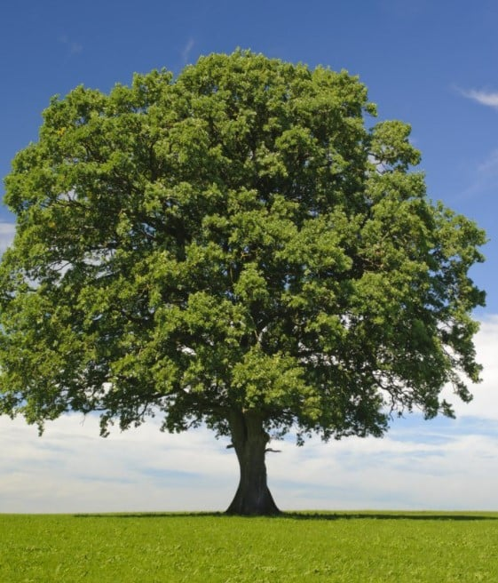
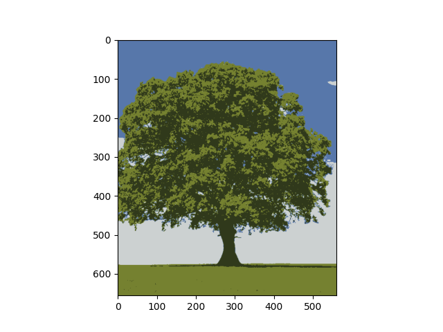

# Image-Compression
Use KMeans Algorithm to do image compression
 
How to use:
1. pip install matplotlib
2. pip install sklearn
3. pip install numpy
4. python ImgCompression.py

Result: 
Before: 
After: 
